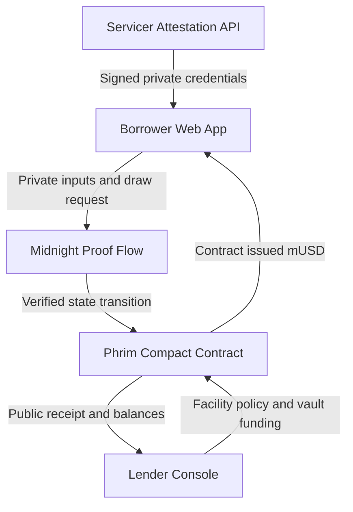

# Phrim Product Requirements Document

**Version:** 1.0  
**Date:** 12 September 2026  
**Status:** Hackathon MVP specification  
**Target network:** Midnight Preprod  
**Primary objective:** Deliver a complete, working proof-to-draw workflow that demonstrates a real use of programmable privacy

## 1 Executive Decision

Phrim is a privacy-preserving borrowing-base draw gate for asset-backed credit facilities.

It lets a fintech borrower prove that a requested draw is backed by eligible receivables without sending the lender the underlying customer-level loan tape. A Midnight smart contract verifies the proof, prevents pledged assets from being reused inside the facility, updates the facility balance, and releases a contract-issued test token when every rule passes.

The MVP must demonstrate an enforced outcome, not a verification badge:

> A valid private collateral proof releases a draw. An invalid, stale, tampered, or replayed proof cannot move funds or change facility state.

**Decision:** Build  
**Confidence:** Medium  
**Primary constraint:** The source data is only as trustworthy as the registered servicer that signs it.  
**Largest technical risk:** Proving eight signed asset records within acceptable demo latency.

## 2 One Line Pitch

> Phrim lets fintech borrowers unlock asset-backed credit by proving their receivables satisfy lender rules without exposing the loan tape, using Midnight to turn a private proof directly into an enforceable draw.

## 3 Problem

### 3.1 Target User

The initial user is a capital-markets or treasury operator at a fintech lender, invoice-financing company, embedded lender, or other specialty-finance business that funds customer assets through a warehouse credit facility.

The economic buyer is either:

- the borrower that wants faster draws and less routine disclosure;
- the warehouse lender that wants consistent policy enforcement and fewer manual checks; or
- a verification agent that administers borrowing-base calculations for both parties.

### 3.2 Trigger

The user needs Phrim whenever the borrower submits a funding request against a pool of receivables. Depending on the facility, that can happen weekly, monthly, or whenever newly originated assets need financing.

### 3.3 Current Workflow

The borrower exports a loan tape or receivables file containing customer-level balances, repayment status, delinquency, maturity, risk fields, and internal identifiers. The lender or verification agent applies eligibility rules, concentration limits, haircuts, and an advance rate before approving the draw.

The workflow is real and budgeted. Finley publicly offers borrowing-base validation, collateral eligibility testing, loan-tape testing, covenant monitoring, and verification services. Its customer material describes fintech companies using debt-capital infrastructure to operate asset-backed facilities.

### 3.4 Pain

- Routine draw requests expose more portfolio data than is needed for a binary eligibility decision.
- Every additional copy of the loan tape increases data-handling and breach exposure.
- Different parties may recalculate the same rules using separate spreadsheets or systems.
- A report can state that a covenant passed without cryptographically binding that result to the underlying signed records.
- Existing verification usually produces a report or approval message; it does not automatically enforce the funding condition.

### 3.5 Problem Statement

> A fintech capital-markets operator needs to prove that a requested warehouse-facility draw is fully backed by eligible assets, but the current process requires sending customer-level loan data to another organization and waiting for a separate calculation, increasing disclosure, operational work, and disagreement risk.

### 3.6 What Phrim Does Not Claim

Phrim does not replace initial underwriting, regulatory examinations, contractual audit rights, or human investigation. It reduces routine over-disclosure for a narrowly defined draw decision after the lender and borrower have already agreed on the facility policy and trusted data issuer.

## 4 Evidence and Product Thesis

### 4.1 Proven Workflow

**Fact:** Finley raised a $17 million Series A after building software for corporate credit and asset-backed debt operations. Its current credit-administration product applies eligibility criteria, haircuts, and advance rates; validates borrowing bases; and independently tests loan tapes and facility triggers.

**Fact:** Midnight's official ZK Loan example verifies a registered provider's signature over private financial data inside a Compact circuit and writes only the authorization result and amount to the public ledger.

**Fact:** Midnight supports contract-issued token custody and contract-mediated transfers. Current documentation says arbitrary smart-contract control of the native NIGHT asset is still outside the supported hybrid-token design.

**Inference:** The verified workflow from debt-capital software can be transformed into a private, contract-enforced draw gate using capabilities that Midnight demonstrates today.

**Assumption:** A lender will accept minimized proof for routine draw eligibility while retaining contractual rights to request selected underlying records during audit or dispute.

### 4.2 Non Gimmick Test

Phrim passes only if all five conditions are present:

1. The collateral data is authenticated by a registered signer.
2. The eligibility calculation occurs over private inputs.
3. The proof is bound to one facility and one reporting period.
4. Nullifiers stop the same attested asset from funding another draw inside that facility.
5. A successful proof causes an atomic ledger and token state change.

If the MVP removes condition 5 and only displays `Verified`, the core product thesis fails.

## 5 Product Goals and Non Goals

### 5.1 MVP Goals

| Goal | Success condition |
| --- | --- |
| Prove private eligibility | Eight signed receivables are evaluated without their private fields being written to the public ledger |
| Authenticate source data | Any changed field causes signature verification or proof generation to fail |
| Enforce the draw | A valid proof updates facility balances and transfers contract-issued `mUSD` in the same call |
| Prevent replay | A second draw using an already consumed asset nonce fails |
| Make the result understandable | A nontechnical observer can see why a draw passed or failed without reading contract code |
| Run reliably | The happy path and four prepared failure paths run repeatedly on Midnight Preprod or the documented local fallback |

### 5.2 Non Goals

- Production lending or real-money deployment
- Native NIGHT custody or payout
- Fiat settlement or bank integrations
- Full loan servicing
- Initial borrower underwriting
- Legal-document parsing
- Dynamic lender policy authoring
- Unlimited asset batches
- Portfolio concentration tests across thousands of records
- Cross-facility or global double-financing prevention
- Repayment, collateral release, waterfall, interest, and liquidation logic
- Multi-chain interoperability
- Fully private draw amount
- Production key custody, compliance certification, or security audit

## 6 Personas and Jobs

### 6.1 Borrower Operator

**Role:** Head of Capital Markets, treasury lead, or finance operator at a specialty-finance company.  
**Job:** Submit eligible collateral and receive funding quickly.  
**Concern:** Do not reveal the entire customer portfolio for every routine draw.  
**Success:** The draw is approved and funded from one workflow.

### 6.2 Lender Operator

**Role:** Credit operations or portfolio-management professional at the capital provider.  
**Job:** Enforce agreed eligibility and facility limits consistently.  
**Concern:** Borrower-provided calculations may be incomplete, stale, modified, or reused.  
**Success:** Only correctly attested collateral can change the facility balance.

### 6.3 Servicer or Verification Agent

**Role:** System or organization that is authorized to attest asset records.  
**Job:** Sign a canonical representation of each asset for a specific period.  
**Concern:** The credential must not be editable or reusable under a different facility.  
**Success:** Phrim accepts credentials signed by the active provider key and rejects all others.

## 7 Core User Stories

| ID | User story | Priority |
| --- | --- | --- |
| US 01 | As a lender, I can create a facility with a borrower, attestor, policy, credit limit, and token so the draw rules are fixed before submission | P0 |
| US 02 | As an attestor, I can issue signed asset credentials for a facility and reporting epoch | P0 |
| US 03 | As a borrower, I can import signed credentials and see their private eligibility locally | P0 |
| US 04 | As a borrower, I can request a draw and generate a proof without uploading raw asset fields to the lender interface | P0 |
| US 05 | As a lender, I can see the public draw amount, proof result, facility balances, epoch, and transaction reference | P0 |
| US 06 | As either party, I can verify that a successful draw consumed unique asset nullifiers | P0 |
| US 07 | As a borrower, I receive clear errors for invalid signatures, insufficient collateral, stale credentials, or replayed assets | P0 |
| US 08 | As a lender, I can freeze or close the facility to stop future draws | P1 |
| US 09 | As an administrator, I can rotate the registered attestor key for future epochs | P1 |
| US 10 | As either party, I can view prior successful draws | P1 |

## 8 Scope and Release Tiers

### 8.1 Tier 1 Must Work Live

- One lender and one borrower
- One active facility
- One registered attestor public key
- One public policy configuration
- Exactly eight credential slots with empty-slot padding
- Borrower-side credential import
- Local proof generation
- Valid private borrowing-base calculation
- Atomic facility-state update and `mUSD` transfer
- Used-nullifier storage and replay rejection
- Lender result view
- Happy path plus four deterministic failure cases
- Deployed contract address and visible transaction reference

### 8.2 Tier 2 Should Work

- Facility freeze
- Attestor rotation for a later epoch
- Successful draw history
- Downloadable public verification receipt
- Local-network fallback mode
- Known successful transaction loaded when Preprod is unavailable

### 8.3 Tier 3 Explain Only

- Shielded payout amount
- Production stablecoin integration
- Thousands of assets and proof aggregation
- Multiple facilities and lenders
- Repayment and release of pledged collateral
- Auditors with selective record disclosure
- ERP, servicing-platform, bank, and data-room integrations
- Concentration, vintage, geographic, and portfolio-wide rules
- Legal enforceability and regulated deployment

## 9 End to End User Flow

### 9.1 Facility Setup

1. Lender connects a Midnight wallet.
2. Lender creates facility `FACILITY_DEMO_001`.
3. Lender sets borrower authorization hash, attestor public key, credit limit, policy thresholds, current epoch, and `mUSD` token color.
4. Lender deposits or mints enough contract-issued `mUSD` to the Phrim contract.
5. UI confirms the active facility and available vault balance.

### 9.2 Credential Issuance

1. Demo servicer loads deterministic sample receivables.
2. It canonicalizes and signs each credential.
3. It returns eight signed credential objects to the borrower.
4. Private asset values are stored only in the borrower session or encrypted local private state.

### 9.3 Draw Request

1. Borrower opens the active facility.
2. Borrower imports or selects up to eight signed credentials.
3. UI calculates a clearly labeled local preview, not an authoritative approval.
4. Borrower enters a public requested draw amount.
5. Phrim generates the Midnight proof.
6. The contract verifies signatures, authorization, policy, facility limits, and unused nullifiers.
7. If valid, it updates facility state and transfers `mUSD` atomically.
8. The result page shows the new facility balance and transaction reference without exposing asset rows.

### 9.4 Failed Request

1. Borrower submits a stale, tampered, undercollateralized, or replayed batch.
2. Proof generation or the circuit assertion fails.
3. No token moves and no facility balance changes.
4. UI shows a safe categorical reason without printing private credential values.

## 10 Functional Requirements

### 10.1 Facility Management

| ID | Requirement | Acceptance criteria |
| --- | --- | --- |
| FR 01 | Create facility | Only the lender admin secret can create a facility; required fields are stored and readable from public ledger state |
| FR 02 | Bind borrower | Draws fail unless the caller proves possession of the borrower secret associated with the stored borrower key hash |
| FR 03 | Register attestor | Facility stores one active attestor public key and provider identifier |
| FR 04 | Store policy | Credit limit, advance rate, maximum delinquency, minimum risk score, minimum remaining term, and current epoch are fixed in facility state |
| FR 05 | Facility status | Draws are allowed only when status is `Active`; `Frozen` and `Closed` reject them |
| FR 06 | Fund vault | Contract exposes its contract-issued `mUSD` balance and rejects a draw larger than that balance |

### 10.2 Credentials

| ID | Requirement | Acceptance criteria |
| --- | --- | --- |
| FR 07 | Canonical schema | Signer and circuit hash exactly the same ordered fields and domain separator |
| FR 08 | Provider signature | Every nonempty credential must verify against the facility's active provider key |
| FR 09 | Stable asset nonce | Reissued credentials for the same underlying asset retain the same opaque asset nonce |
| FR 10 | Epoch binding | Credential epoch must equal the facility's active reporting epoch |
| FR 11 | Facility binding | Credential facility identifier must equal the target facility |
| FR 12 | Empty padding | Unused vector slots use a defined empty value and contribute neither balance nor nullifier |

### 10.3 Private Eligibility Proof

| ID | Requirement | Acceptance criteria |
| --- | --- | --- |
| FR 13 | Eligibility rules | Every selected asset satisfies delinquency, risk, remaining-term, balance, facility, epoch, and signature checks |
| FR 14 | Borrowing base | Sum uses bounded integer arithmetic and never floating point |
| FR 15 | Advance-rate rule | Circuit enforces `eligibleBalance * advanceRateBps >= requestedDraw * 10000` |
| FR 16 | Credit-limit rule | Circuit enforces `outstanding + requestedDraw <= creditLimit` |
| FR 17 | Positive request | Zero-value draws and zero-balance selected assets fail |
| FR 18 | Privacy | Asset identifiers, balances, risk values, delinquency, maturity, asset nonce, and signatures are never stored in public ledger fields |

### 10.4 Replay Prevention and Settlement

| ID | Requirement | Acceptance criteria |
| --- | --- | --- |
| FR 19 | Nullifier derivation | Every selected asset produces a domain-separated nullifier bound to its stable asset nonce and facility identifier |
| FR 20 | Unused check | A request fails when any selected asset nullifier already exists in the used-nullifier set |
| FR 21 | Atomic update | Nullifier insertion, outstanding-balance update, available-credit update, draw record, and token transfer succeed or fail together |
| FR 22 | Transfer | Successful draw sends the exact public requested amount of contract-issued `mUSD` to the authorized borrower address |
| FR 23 | Public receipt | Successful draw stores draw identifier, facility identifier, epoch, amount, resulting outstanding balance, and completion status |

### 10.5 Interface and Feedback

| ID | Requirement | Acceptance criteria |
| --- | --- | --- |
| FR 24 | Private-data indicator | Borrower UI clearly labels which values stay private and which values become public |
| FR 25 | Proof progress | UI distinguishes preparing inputs, generating proof, wallet approval, submitting transaction, and confirmation |
| FR 26 | Safe errors | Errors use categories and remediation; they do not echo private values or secrets |
| FR 27 | Lender view | Lender can see policy, draw amount, state transition, and proof status but no private asset rows |
| FR 28 | Independent proof | Result includes contract address and transaction identifier that judges can inspect |

## 11 Data Model

### 11.1 Public Ledger State

The smart contract maintains public facility configurations, debt accounting, and verification receipts directly on the Midnight ledger.

#### Table 11.1: Facility State Record

| Field Name | Type | Visibility | Description |
|---|---|---|---|
| `facilityId` | Bytes (32 bytes) | Public | Unique cryptographic identifier for the credit facility |
| `lenderAuthorityHash` | Bytes (32 bytes) | Public | Hash commitment of the lender authorization credential |
| `borrowerAuthorityHash` | Bytes (32 bytes) | Public | Hash commitment of the borrower authorization credential |
| `attestorProviderId` | Unsigned Integer (32-bit) | Public | Registered servicer or verification agent identifier |
| `attestorPublicKeyX` | Field Element | Public | Affine X-coordinate of attestor signature verification key |
| `attestorPublicKeyY` | Field Element | Public | Affine Y-coordinate of attestor signature verification key |
| `tokenColor` | Bytes (32 bytes) | Public | Asset identifier for the contract-issued payout token (`mUSD`) |
| `creditLimit` | Unsigned Integer (128-bit) | Public | Maximum allowable facility debt in minor currency units |
| `outstanding` | Unsigned Integer (128-bit) | Public | Current cumulative active borrowed principal |
| `advanceRateBps` | Unsigned Integer (16-bit) | Public | Haircut multiplier in basis points (e.g., 8000 = 80.00%) |
| `maxDaysPastDue` | Unsigned Integer (16-bit) | Public | Delinquency cutoff; receivables overdue past this threshold are ineligible |
| `minRiskScore` | Unsigned Integer (16-bit) | Public | Credit quality threshold; receivables below this score are ineligible |
| `minRemainingEpochs` | Unsigned Integer (16-bit) | Public | Minimum remaining duration before asset maturity |
| `currentEpoch` | Unsigned Integer (32-bit) | Public | Active reporting cycle counter |
| `status` | State Enumeration | Public | Operational state: `Active`, `Frozen`, or `Closed` |

#### Table 11.2: Draw Receipt Record

| Field Name | Type | Visibility | Description |
|---|---|---|---|
| `drawId` | Bytes (32 bytes) | Public | Deterministic identifier derived from facility, epoch, and amount |
| `facilityId` | Bytes (32 bytes) | Public | Target facility against which the draw was executed |
| `epoch` | Unsigned Integer (32-bit) | Public | Reporting cycle in which the draw occurred |
| `amount` | Unsigned Integer (128-bit) | Public | Quantity of `mUSD` tokens issued to the borrower |
| `resultingOutstanding` | Unsigned Integer (128-bit) | Public | Updated facility outstanding balance following settlement |
| `completed` | Boolean | Public | Confirms atomic execution and balance settlement |

#### Table 11.3: Nullifier Registry

| Field Name | Type | Visibility | Description |
|---|---|---|---|
| `usedAssetNullifiers` | Set of Bytes (32 bytes) | Public | Persistent hash set recording consumed asset nonces to prevent double financing |

### 11.2 Private Credential Data

Asset credentials originate from an authorized servicer. Each record contains customer-level facts and the attestor signature. These fields are imported exclusively into the borrower local browser witness and are never published to the public ledger.

#### Table 11.4: Attested Asset Credential Structure

| Field Name | Type | Boundary | Description |
|---|---|---|---|
| `schemaVersion` | Unsigned Integer (8-bit) | Private (Local) | Structural version ensuring serialization parity between signer and circuit |
| `providerId` | Unsigned Integer (32-bit) | Private (Local) | Identifier matching the facility registered attestor |
| `facilityId` | Bytes (32 bytes) | Private (Local) | Facility binding ensuring credentials cannot be ported across facilities |
| `assetNonce` | Bytes (32 bytes) | Private (Local) | Opaque, persistent unique identifier assigned by attestor for asset lifecycle |
| `outstandingMinor` | Unsigned Integer (64-bit) | Private (Local) | Principal receivable balance in minor currency units (cents) |
| `daysPastDue` | Unsigned Integer (16-bit) | Private (Local) | Delinquency aging metric evaluated against `maxDaysPastDue` |
| `riskScore` | Unsigned Integer (16-bit) | Private (Local) | Quantitative credit score evaluated against `minRiskScore` |
| `maturityEpoch` | Unsigned Integer (32-bit) | Private (Local) | Expiration epoch evaluated against `minRemainingEpochs` |
| `snapshotEpoch` | Unsigned Integer (32-bit) | Private (Local) | Reporting epoch in which the servicer signed the data |
| `signatureR8x` | Field Element | Private (Local) | EdDSA signature point X-coordinate |
| `signatureR8y` | Field Element | Private (Local) | EdDSA signature point Y-coordinate |
| `signatureS` | Field Element | Private (Local) | EdDSA signature scalar component |

`assetNonce` is an opaque 32-byte value assigned once by the attestor for the life of the asset. The attestor must not issue a different nonce for the same asset because that would allow Phrim's local replay protection to be bypassed.

### 11.3 Disclosure Matrix

| Data | Borrower | Attestor | Lender UI | Public ledger |
| --- | ---: | ---: | ---: | ---: |
| Customer or asset identifier | Yes | Yes | No | No |
| Outstanding balance per asset | Yes | Yes | No | No |
| Delinquency and risk score | Yes | Yes | No | No |
| Asset nonce and signature | Yes | Yes | No | No |
| Facility policy | Yes | Yes | Yes | Yes |
| Requested draw amount | Yes | Optional | Yes | Yes |
| Approval and resulting outstanding | Yes | Optional | Yes | Yes |
| Asset nullifiers | Derived | No | Hash only | Hash only |

## 12 Trust Model

### 12.1 Trusted Parties

- The lender is trusted to define the policy and fund the vault.
- The registered attestor is trusted to issue truthful records and maintain a stable asset nonce.
- Each role is responsible for protecting its authorization secret.

### 12.2 Cryptographically Enforced Properties

- A credential cannot be modified without invalidating its signature.
- Private fields must satisfy the public policy before a draw can execute.
- The proof is bound to the facility and current epoch.
- Used asset nonces cannot be submitted again inside the same facility contract.
- Facility accounting and token release occur atomically.

### 12.3 Explicitly Unsolved Trust

- Phrim cannot determine whether the attestor's source database is truthful.
- Phrim cannot detect the same asset being financed through an unrelated system that does not share its nullifier registry.
- Phrim cannot force a bank or legal agreement to recognize the onchain result.
- Phrim cannot prevent the borrower or attestor from voluntarily disclosing their own local data.

## 13 Technical Architecture

### 13.1 Components

| Component | Responsibility | MVP implementation |
| --- | --- | --- |
| Borrower web app | Import credentials, preview locally, enter draw, generate proof, submit transaction, display result | React and TypeScript with Midnight wallet and private-state provider |
| Lender console | Create facility, set policy, register provider, fund vault, view draw history | React routes within the same application |
| Attestation API | Canonicalize and sign deterministic asset credentials | Node TypeScript service using a fixed demo dataset and persistent demo signing key |
| Compact contract | Verify authorization, provider signatures, policy, borrowing base, credit limit, nullifiers, state, and transfer | One deployable Phrim contract |
| Contract-issued token | Represent demo draw value | Unshielded `mUSD` token held and transferred by the contract |
| Indexer and network adapters | Read public facility and draw state and submit calls | Midnight JavaScript providers targeting Preprod with local fallback |

### 13.2 Why Midnight

Phrim needs private circuit inputs, signature verification over authenticated off-chain data, persistent commitments or nullifiers, and a public state transition. Midnight's official ZK Loan example demonstrates the signed-private-data pattern, while Compact keeps witness-derived values private unless they are explicitly disclosed. The token primitives allow a contract to hold and send contract-issued value after the proof passes.

### 13.3 Frontend Technical Stack & Design Architecture

The frontend architecture is engineered to deliver a single-viewport, immersive cyber-financial experience that runs real-time animated WebGL/ASCII backgrounds at 60fps while orchestrating intensive Midnight zero-knowledge cryptographic proofs.

#### Table 13.1: Frontend Technology Stack

| Layer | Selected Technology | Role & Justification |
|---|---|---|
| **Build & Development Tooling** | **Vite 5+** | Native ES modules, sub-second HMR, optimized tree-shaking, and first-class WebAssembly (WASM) support for Midnight cryptographic primitives. |
| **Component Architecture** | **React 18+ & TypeScript** | Declarative state management for complex multi-stage ZK proving lifecycles, strict static typing across credential schemas, and modular view encapsulation. |
| **Background Art & Shaders** | **Custom WebGL / GLSL Fragment Shader** | High-performance, GPU-accelerated screen-space ASCII rasterization running at 60fps with zero main-thread CPU overhead. |
| **3D Interactive Meshes** | **Three.js + `AsciiEffect.js`** | Renders dynamic 3D spatial models (Isometric Vault for Facility Setup, Token Coin for Settlement) transformed into ASCII characters. |
| **View Transition Engine** | **AsciiMorph** | Character-by-character text scrambling and interpolation during tab and page transitions. |
| **Styling & Design Tokens** | **Pure CSS Custom Properties (Tokens)** | Zero-runtime CSS variables (`:root`) guaranteeing strict theme consistency, instant token switching, and zero framework CSS bloat. |
| **Layout & Responsiveness** | **Modern CSS Clamp & Dynamic Viewport Units** | Strict single-viewport layout (`height: 100vh / 100dvh`, `overflow: hidden`) utilizing responsive `clamp()` mathematical scaling for fluid desktop-to-mobile scaling without scrollbars. |
| **Typography Pipeline** | **Inter + BubbledotICG-FinePos + Geist Pixel Circle** | Dual-tier typography combining institutional sans-serif UI clarity with retro dot-matrix cyberpunk display authority. |
| **Iconography** | **Font Awesome 6.5.2 & Retro Glyphs** | CDN-distributed brand marks (Microsoft, Amazon, Google) and custom monospace dot-matrix stat symbols (`<`, `%`, `*`, `#`). |
| **Animation Engine** | **Hardware-Accelerated CSS Keyframes & RAF** | GPU-accelerated cubic-bezier transitions (`revealPulse`, `slideDown`, `headlineFade`) and requestAnimationFrame-driven tabular counter interpolations. |
| **Web3 Wallet Connection** | **`@midnight-ntwrk/wallet-api`** | Seamless browser extension integration with Midnight Lace wallet for key derivation, balance queries, and transaction submission. |
| **Contract Client SDK** | **`@midnight-ntwrk/midnight-js-contracts`** | Typesafe contract bindings for invoking `createFacility`, `fundOrMintDemoToken`, and `requestDraw` on Midnight Preprod. |
| **Proof Synthesis Concurrency** | **Dedicated Web Workers** | Offloads client-side witness generation and ZK proof synthesis to a background thread to prevent UI freezing and frame drops on the ASCII canvas. |

## 14 Compact Contract Specification

### 14.1 Exported Circuits

#### Table 14.1: Smart Contract Operations & Functional Interfaces

| Circuit / Function | Parameters | Authorized Role | Priority | Enforced State Impact |
|---|---|---|---|---|
| `createFacility` | Facility configuration, policy thresholds, authority commitments, attestor public key | Lender | P0 | Initializes new facility record, sets policy bounds, and activates state |
| `fundOrMintDemoToken` | Facility identifier, deposit amount | Lender | P0 | Credits facility vault balance to back future draw requests |
| `requestDraw` | Facility ID, requested amount, 8 credential slots, borrower secret | Borrower | P0 | Verifies signatures, evaluates eligibility, commits nullifiers, updates outstanding, and transfers tokens |
| `freezeFacility` | Facility identifier, lender authorization secret | Lender | P1 | Temporarily halts new draw requests during covenant review |
| `closeFacility` | Facility identifier, lender authorization secret | Lender | P1 | Permanently shuts down the facility; rejects all subsequent draw requests |
| `rotateAttestor` | Facility identifier, new provider key, effective epoch, lender secret | Lender | P1 | Updates registered signature verification key for future reporting periods |
| `advanceEpoch` | Facility identifier, next epoch counter, lender secret | Lender | P1 | Increments current reporting epoch to support new reporting cycles |

Only `createFacility`, `requestDraw`, and a working vault-funding path are P0 for MVP delivery.

### 14.2 Request Draw Verification and Settlement Workflow

The draw request circuit evaluates zero-knowledge proofs over private asset credentials and applies atomic ledger transitions. Execution follows a strict four-stage verification sequence:

#### Stage 1: Facility and Authority Pre-Conditions
1. **Facility Existence & Status:** Confirm that the target facility exists on the ledger and verify that `facility.status` is strictly `Active`.
2. **Caller Authentication:** Derive the borrower authority hash from the private `borrowerSecret` and ensure it equals `facility.borrowerAuthorityHash`.
3. **Amount Sanity:** Validate that the requested draw amount is greater than zero.
4. **Credit Capacity:** Verify that `facility.outstanding + requestedAmount` does not exceed `facility.creditLimit`.

#### Stage 2: Batch Credential and Policy Verification (Iterating 8 Slots)
For each of the eight credential slots in the batch:
1. **Empty Slot Handling:** If the slot is designated empty (used for padding smaller batches), skip eligibility checks and continue to the next slot.
2. **Provider and Facility Binding:** Ensure `credential.providerId` equals `facility.attestorProviderId` and `credential.facilityId` equals `facility.facilityId`.
3. **Freshness Validation:** Ensure `credential.snapshotEpoch` strictly equals `facility.currentEpoch`.
4. **Cryptographic Signature Verification:** Verify the EdDSA signature against the registered `attestorPublicKey` over the canonical credential message.
5. **Policy Compliance Enforcement:**
   - Asset principal must be positive (`outstandingMinor > 0`).
   - Delinquency must not exceed the allowed threshold (`daysPastDue <= facility.maxDaysPastDue`).
   - Credit score must satisfy minimum quality rules (`riskScore >= facility.minRiskScore`).
   - Remaining tenure must satisfy duration rules (`maturityEpoch >= facility.currentEpoch + facility.minRemainingEpochs`).
6. **Nullifier Derivation and Anti-Replay Guard:**
   - Compute the domain-separated persistent nullifier: `persistentHash("phrim:asset-nullifier:v1", facility.facilityId, credential.assetNonce)`.
   - Verify that the nullifier does not already exist in `usedAssetNullifiers`.
   - Verify that the nullifier is not duplicated within the current request batch.
   - Accumulate `credential.outstandingMinor` into `eligibleTotal` and queue the nullifier for storage.

#### Stage 3: Borrowing Base Calculation and Vault Solvency
1. **Active Collateral Requirement:** Confirm that at least one valid, non-empty credential was processed (`selectedCredentialCount > 0`).
2. **Advance Rate Constraint:** Verify that `eligibleTotal * facility.advanceRateBps >= requestedAmount * 10000`.
3. **Vault Solvency:** Confirm that `contractTokenBalance >= requestedAmount`.

#### Stage 4: Atomic Ledger Commit and Token Settlement
1. **Nullifier Persistence:** Commit all newly derived nullifiers into the persistent `usedAssetNullifiers` registry.
2. **Debt Accounting:** Increment `facility.outstanding` by `requestedAmount`.
3. **Receipt Generation:** Generate and record a public `DrawReceipt` containing the draw ID, facility ID, epoch, funded amount, and resulting outstanding balance.
4. **Token Transfer:** Release `requestedAmount` of contract-issued `mUSD` tokens directly to the borrower address.

### 14.3 Arithmetic Rules

- Use integer minor units only.
- Use basis points for the advance rate.
- Use a sufficiently wide intermediate type before multiplication.
- Reject values that would overflow the selected type.
- Do not use division or floating point inside the circuit.
- Keep maximum credential count fixed at eight for the MVP.

### 14.4 Authorization

Do not use an unverified caller-reported public key as authentication. Lender and borrower authorization must derive a public hash from a private secret and compare it with the stored authority hash. Provider signatures must be verified inside the circuit against the registered provider key.

## 15 Attestation Service

### 15.1 MVP Endpoints

| Method | Endpoint | Purpose |
| --- | --- | --- |
| `GET` | `/health` | Demo preflight |
| `GET` | `/v1/provider` | Return provider identifier and public key |
| `GET` | `/v1/fixtures/:scenario` | Return deterministic sample data for an allowed demo scenario |
| `POST` | `/v1/credentials/sign` | Canonicalize and sign up to eight demo asset records |

### 15.2 Deterministic Scenarios

- `eligible`: $100,000 eligible balance; $75,000 draw passes at 80%.
- `undercollateralized`: two assets become delinquent; eligible balance falls to $85,000 and the same draw fails.
- `stale`: credential epoch is one period behind.
- `tampered`: one field is changed after signing.
- `replay`: the previously successful eligible batch is submitted again.

### 15.3 Canonicalization

The signer and circuit must share a versioned, byte-exact field order and domain separator. Schema version, provider identifier, facility identifier, and snapshot epoch must be included in the signed message. Test vectors must compare signer output with circuit verification before UI work begins.

## 16 Interface & Visual Design System

### 16.1 Design Foundation & UI Style Specification

The user interface follows a single-viewport, high-contrast aesthetic that merges modern institutional Web3 elegance with retro dot-matrix cyberpunk financial engineering. The implementation is static, vanilla (HTML5 + CSS3 + Vanilla ES6 JS), and fully responsive without horizontal or vertical scrollbars.

#### 16.1.1 Color System & Design Tokens

| Token Name | Value | Role / Usage |
|---|---|---|
| `--bg` | `#000000` | Pure onyx black background canvas |
| `--text` | `#ffffff` | Primary crisp white copy, headlines, and active counters |
| `--muted` | `#8e8e8e` | Subdued metadata, inactive link states, and metric labels |
| `--nav-text` | `#2e2e2e` | Deep charcoal typography on white pill surfaces |
| `--pill-dark` | `#28282a` | Dark gunmetal background for secondary actions and avatar rings |
| `--sign-in-text` | `#c8c8c8` | High-legibility silver text on dark surfaces |
| `--nav-shadow` | `0 4px 14px rgba(0, 0, 0, 0.16)` | Soft, diffused floating elevation on pills and badges |
| `--trust-bg` | `#28282a` | Outer avatar container and trust pill background |
| `--trust-border` | `rgba(255, 255, 255, 0.4)` | Translucent edge highlighting pill borders |
| `--trust-text` | `#c4c2c3` | Refined silver text for enterprise credentials |

#### 16.1.2 Typography System

* **UI Primary Typography:** `Inter`, `"Segoe UI"`, system-ui, sans-serif (Weights: `400` Regular, `500` Medium, `600` Semi-Bold). Used for navigation labels, body copy, metric numbers, button text, and modal controls.
* **Primary Display & Retro Glyphs:** `BubbledotICG-FinePos` (OnlineWebFonts CDN) with fallback to `Geist Pixel Circle` (local WOFF2) and `monospace`. Used for hero display headlines (`clamp(28px, 6.2vw, 80px)`), metric icon glyphs (`<`, `%`, `*`, `#`), and architectural ASCII accents.
* **Iconography:** Font Awesome 6.5.2 brand glyphs (Microsoft, Amazon, Google) for enterprise trust indicators.

#### 16.1.3 Core Component Design Patterns

* **Single-Viewport Composition:** Root layout `.page` uses `display: flex; flex-direction: column; justify-content: space-between; height: 100vh / 100dvh; overflow: hidden;` with vertical clamp padding.
* **Header & Brand Emblem:** Centered row (max-width `720px`). Includes a circular white `#fff` brand button (`clamp(40px, 4.4vw, 46px)`) housing a centered 72% scaled geometric intelligence mark, an elongated white nav pill (`44px`–`48px` height, radius `999px`) with three-dot active indicators (`::after` with `box-shadow: -5px 0 0 #000, 5px 0 0 #000; bottom: 5px`), and a dark pill button.
* **Enterprise Trust Row:** Three overlapping circular avatar rings (`--trust-size: clamp(36px, 4.5vw, 42px)`) featuring `5px` padding, inner white circles with black brand marks, and hover lifts (`-2px`, `-4px`, `-2px`), overlapping `-0.42 * trust-size` into the dark `Trusted by 2000+ Enterprises` pill.
* **Glowing Pill Call-to-Action:** High-contrast white pill with black bold text, multi-layered halo glow (`0 0 0 1px rgba(255,255,255,0.15), 0 0 22px rgba(255,255,255,0.32), 0 0 44px rgba(255,255,255,0.12)`), pulsing entry animation (`revealPulse`), and hover scaling.
* **Animated Metric Counters:** 4-column tabular grid pairing dot-matrix icons with `easeOutCubic` counters (`1500 + i*80ms` duration, `480 + i*90ms` staggered offset), evaluated once via IntersectionObserver at `0.25` threshold.
* **Mobile Navigation Drawer (≤720px):** Circular `48×48px` hamburger button transitioning into a black X on a white disc (`translateY(±6.5px)` and `rotate(±45deg)`), fixed full-screen glass backdrop overlay (`rgba(0, 0, 0, 0.62)` with `blur(6px)`), and floating white sheet menu (`border-radius: 28px`) with staggered link animations.

---

### 16.2 Background Themes Architecture: Video and Page-Specific ASCII Art

To maintain visual dynamism while keeping memory and CPU utilization optimized, the application uses distinct visual themes for the background layer behind the UI:

1. **Landing Page:** Full-bleed, full-viewport looping MP4 video (`object-fit: cover; pointer-events: none; z-index: 0`) depicting evolving intelligence neural waves.
2. **Application Operational Views (Pages 1 to 5):** Driven by an autonomous WebGL / Canvas2D procedural ASCII art engine (see detailed research in `docs/ASCII-ART-RESEARCH.md`). Each page renders a unique, animated ASCII visual metaphor:

| Page | Operational Purpose | ASCII Art Background Theme | Visual Metaphor & Dynamics |
|---|---|---|---|
| **Landing** | Product Pitch & Value Proposition | **CloudFront Cover Video** | Organic evolving neural field |
| **Page 1** | Facility Setup & Policy Configuration | **The Cryptographic Vault** | Isometric 3D rotating vault safe with rotating concentric dials |
| **Page 2** | Private Collateral & Loan Tape Import | **The Confidential Matrix Stream** | Dual-layer streaming loan tape with cascading nullifier masks |
| **Page 3** | Draw Request & ZK Proof Generation | **The ZK Circuit Synthesizer** | Kinetic cryptographic circuit board with pulsing Fourier proof waves |
| **Page 4** | Draw Result & Settlement Confirmation | **Atomic Settlement & Token Beam** | Ascending token particle fountain and invariant balance scales |
| **Page 5** | Facility History & Verifiable Audit Log | **The Merkle DAG & Block Lattice** | Chronological horizontal block chain and verifiable vector links |

#### 16.2.1 Real-Time WebGL & ASCII Shader Rendering Pipeline

The operational pages utilize an autonomous `<canvas id="phrim-ascii-bg">` mounted as a global background layer (`position: absolute; inset: 0; pointer-events: none; z-index: 0`). 

* **Shader Mechanism:** A custom GLSL fragment shader calculates procedural Signed Distance Fields (SDF) or samples 3D geometric projections, dividing the viewport into monospace character cells (e.g., 8×14px). Pixel brightness maps directly to character glyphs from an embedded monospace bitmap font texture.
* **Uniform Inputs:** The shader accepts `u_resolution` (viewport dimensions), `u_time` (continuous elapsed time for 60fps wave dynamics), `u_mouse` (subtle parallax tilt), and `u_theme` (active page identifier).
* **3D Spatial Objects (Three.js + AsciiEffect):** On Page 1 (Vault) and Page 4 (Token Settlement), the background engages a lightweight Three.js scene utilizing `AsciiEffect.js`, translating geometric wireframes directly into dynamic monospace text arrays.

#### 16.2.2 State Machine & Navigation Theme Transitions (AsciiMorph)

* When the user navigates between application views (e.g., advancing from *Private Collateral* to *Draw Request*), an `AsciiMorph` controller intercepts the transition.
* The character buffer scrambles for 300ms through high-entropy intermediate glyphs (`@`, `#`, `*`, `%`, `&`, `!`) before resolving smoothly into the target page's ASCII art theme.
* This reinforces the cyberpunk cryptographic motif of transforming confidential data into mathematical proofs.

#### 16.2.3 Performance Budget & Concurrency Strategy

* **60 FPS Hardware Guarantee:** The WebGL ASCII pipeline runs entirely on the GPU. Even on integrated graphics, memory footprint is capped under 25MB VRAM and draws under 4% GPU load.
* **Thread Isolation (Web Worker Proving):** Midnight zero-knowledge witness calculations and proof server queries are isolated in a background Web Worker. This guarantees that computationally heavy proof generation never drops frames on the ASCII canvas or causes user interface stutter.
* **Reduced-Motion Fallback:** When `prefers-reduced-motion: reduce` is enabled, procedural animations halt, rendering a static high-contrast ASCII frame with solid typography.

---

### 16.3 Landing Page (Single-Viewport Overview)

* **Primary Purpose:** Explain Phrim value proposition, display enterprise proof-of-concept trust, showcase key latency/uptime performance metrics, and invite the user into the loan tape proof workflow.
* **Key Visual Elements:**
  - Header with circular mark and white nav pill.
  - Overlapping enterprise trust badge (Microsoft, Amazon, Google).
  - Retro dot-matrix two-line headline: `Intelligence` / `Designed To Evolve`.
  - Muted value proposition subhead.
  - Glowing white `Get Started` CTA pill.
  - 4-metric footer: `< 120ms` Inference Time, `% 99.99%` Platform Uptime, `* 24/7` Autonomous Runtime, `# 2.4M` Context Windows.

---

### 16.4 Page 1 Facility Setup

* **Primary User:** Lender  
* **Purpose:** Establish policy rules, advance rate, and vault funding before borrower requests draws.
* **ASCII Background:** *The Cryptographic Vault* (isometric 3D vault with rotating dials).
* **Required Input Fields:**
  - Facility identifier
  - Borrower authority hash
  - Provider identifier and public verification key
  - Credit limit ($)
  - Advance rate (basis points / %)
  - Maximum days past due cutoff
  - Minimum acceptable credit risk score
  - Minimum remaining term (epochs)
  - Active snapshot epoch
  - Token color and vault funding deposit
* **Primary Action:** `Create and Fund Facility`

---

### 16.5 Page 2 Private Collateral

* **Primary User:** Borrower  
* **Purpose:** Select signed asset credentials and visualize the private/public privacy boundary.
* **ASCII Background:** *The Confidential Matrix Stream* (dual-layer loan tape with nullifier masking).
* **Requirements:**
  - Display eight imported receivable rows in local browser state.
  - Clearly tag every individual asset attribute as `Private`.
  - Display EdDSA cryptographic signature verification status per record.
  - Display real-time local borrowing-base preview with explicit caveat: `Calculated locally; contract proof is authoritative`.
  - One-click selector for deterministic demo scenarios (`Eligible`, `Undercollateralized`, `Stale`, `Tampered`, `Replay`).
  - Zero telemetry / credential exposure in browser logs.
* **Primary Action:** `Continue to Draw Request`

---

### 16.6 Page 3 Draw Request

* **Primary User:** Borrower  
* **Purpose:** Generate zero-knowledge proof and dispatch atomic settlement transaction.
* **ASCII Background:** *The ZK Circuit Synthesizer* (kinetic circuit board with convergence pulse).
* **Requirements:**
  - Draw amount input field with credit limit validation.
  - Public-data disclosure preview (Facility ID, Epoch, Requested Amount).
  - Private-data summary (Number of confidential assets pledged).
  - Multi-stage proof progress visualizer (witness preparation -> proving circuit -> wallet signature -> ledger confirmation).
  - Safe error recovery guidance on failure.
* **Primary Action:** `Prove and Request Draw`

---

### 16.7 Page 4 Draw Result

* **Primary Users:** Borrower and Lender  
* **Purpose:** Demonstrate the cryptographically enforced state transition and settlement.
* **ASCII Background:** *Atomic Settlement & Token Beam* (ascending value particles and balance scale).
* **Successful State Presentation:**
  - Prominent `Draw funded` confirmation badge.
  - Requested draw amount funded.
  - Prior vs. updated facility outstanding debt.
  - Remaining available credit.
  - Borrower `mUSD` wallet balance increase.
  - Consumed nullifier count.
  - Contract address and onchain transaction identifier.
  - Navigation link to Facility History.
* **Failed State Presentation:**
  - Categorical failure reason (`INVALID_SIGNATURE`, `INSUFFICIENT_COLLATERAL`, `ASSET_ALREADY_USED`, etc.).
  - Explicit confirmation that zero funds moved and facility state remained unmodified.
  - Contextual recovery guidance.

---

### 16.8 Page 5 Facility History

* **Primary User:** Lender  
* **Purpose:** Continuous covenant tracking, historical facility health, and auditable proof receipts.
* **ASCII Background:** *The Merkle DAG & Block Lattice* (chronological block chain).
* **Requirements:**
  - Facility operational status (`Active`, `Frozen`, `Closed`).
  - Balance cards: Vault liquidity, outstanding drawn balance, remaining capacity.
  - Chronological draw transaction receipts log (draw ID, epoch, amount, resulting balance).
  - Facility freeze toggle (for Tier 2 implementation).
  - Strict absence of private customer-level collateral records.

## 17 Error Model

| Error code | User message | State impact | Recovery |
| --- | --- | --- | --- |
| `INVALID_SIGNATURE` | One or more credentials are not authentic | None | Request a new signed credential batch |
| `WRONG_FACILITY` | Credentials belong to another facility | None | Load credentials issued for this facility |
| `STALE_EPOCH` | Credentials are from an earlier reporting period | None | Refresh from the servicer |
| `ASSET_INELIGIBLE` | One or more selected assets do not meet the facility policy | None | Select a valid signed batch |
| `INSUFFICIENT_COLLATERAL` | Eligible collateral does not support this draw | None | Lower the draw or add eligible assets |
| `ASSET_ALREADY_USED` | One or more assets already funded a draw | None | Use unpledged assets |
| `CREDIT_LIMIT_EXCEEDED` | The draw exceeds remaining facility capacity | None | Lower the draw |
| `VAULT_INSUFFICIENT` | The contract vault cannot fund the request | None | Lender funds the vault |
| `FACILITY_INACTIVE` | The facility is frozen or closed | None | Contact the lender |
| `UNAUTHORIZED` | The current user cannot perform this action | None | Connect the correct role |
| `NETWORK_UNAVAILABLE` | The request could not reach Midnight | None | Retry or use the prepared local fallback |

## 18 Security and Privacy Requirements

### 18.1 Mandatory Controls

- Treat all witness outputs and client inputs as untrusted until constrained in the circuit.
- Verify the provider signature inside the circuit.
- Use domain-separated persistent hashes for authority keys, credentials, nullifiers, and draw identifiers.
- Never reuse commitment randomness.
- Bind credentials to schema version, provider, facility, and epoch.
- Detect duplicate nullifiers both against ledger state and within the current request.
- Store no raw credential, signature, borrower secret, lender secret, or provider private key on the public ledger.
- Never place role secrets in source code, fixtures committed to a public repository, query strings, logs, or analytics.
- Persist the demo provider key between restarts so already issued credentials do not become invalid unexpectedly.
- Reject zero, negative-equivalent, out-of-range, and overflow-prone amounts.
- Use a fixed dependency set compatible with the selected Midnight compiler and SDK versions.

### 18.2 Privacy Acceptance Test

After a successful draw, inspect public contract state, transaction data, application logs, browser network requests, and repository fixtures. None may reveal asset-level balances, delinquency, risk score, maturity, asset nonce, or provider signature.

### 18.3 Known Security Limitations

- The demo attestation API is a centralized trust root.
- The MVP does not use hardware-backed signing or multi-party authorization.
- An attestor compromise can produce fraudulent but cryptographically valid credentials.
- Nullifiers prevent reuse only within Phrim's shared contract state.
- A public draw amount can reveal some aggregate commercial information.
- The MVP has not undergone an independent security audit.

## 19 Nonfunctional Requirements

| Area | Requirement |
| --- | --- |
| Proof latency | Target less than 60 seconds for eight credentials on the demo machine; measure rather than promise |
| Reliability | Each prepared scenario succeeds or fails identically in five consecutive rehearsals |
| Responsiveness | Core pages usable at 1280 by 720 and common laptop widths |
| Accessibility | Keyboard-accessible actions, visible focus, non-color-only status, descriptive errors |
| Observability | Log stage, duration, transaction identifier, and categorical error only; never private credential values |
| Recovery | Network failure permits safe retry without accidentally creating a second successful draw |
| Reproducibility | Repository includes pinned versions, setup instructions, fixtures, test command, and deployment steps |

## 20 Test Plan

### 20.1 Contract and Circuit Tests

- Valid eight-asset proof funds the requested draw.
- Valid subset with empty padding works.
- Altered balance invalidates the signature.
- Wrong provider key fails.
- Wrong facility identifier fails.
- Stale epoch fails.
- Excessive delinquency fails.
- Insufficient risk score fails.
- Insufficient remaining term fails.
- Zero balance fails.
- Empty credential set fails.
- Insufficient collateral fails.
- Credit limit exceeded fails.
- Insufficient vault balance fails.
- Wrong borrower secret fails.
- Frozen and closed facility fail.
- Same asset duplicated within one request fails.
- Previously used asset fails in a later request.
- Boundary values at each threshold behave correctly.
- Maximum supported amounts do not overflow.
- Failed transactions leave outstanding, vault balance, history, and nullifier set unchanged.

### 20.2 Integration Tests

- Attestation service signature matches the circuit's canonical message.
- Frontend imports every deterministic scenario.
- Public ledger state refreshes after confirmation.
- Borrower token balance increases by the exact draw amount.
- Result page contains a usable transaction reference.
- No private field appears in application requests unrelated to proof generation.

### 20.3 Demo Acceptance Gate

The submission is demo-ready only when:

1. Happy path runs five times without manual repair.
2. Tampered, stale, undercollateralized, and replay scenarios each fail as designed.
3. Failed cases move no tokens and change no contract state.
4. A fresh environment can be started from the README.
5. A known successful transaction and short recorded fallback exist.

## 21 Three Minute Demo Script

### 0 00 to 0 20 Problem

Show the private loan tape in the borrower interface.

> This fintech needs a $75,000 draw. Today it may send a customer-level loan tape so another party can recalculate whether the collateral qualifies.

### 0 20 to 0 35 Promise

> Phrim proves the borrowing base privately and makes the result enforceable. The lender receives the decision and facility state, not the underlying asset records.

### 0 35 to 1 35 Happy Path

1. Show eight signed private receivables totaling $100,000.
2. Show the lender's public 80% advance-rate policy.
3. Enter a $75,000 draw.
4. Generate and submit the proof.
5. Show `Draw funded`, the borrower balance increase, and facility outstanding update.
6. Briefly show the Midnight transaction reference.

### 1 35 to 2 05 Undercollateralized Path

1. Load a new signed epoch where two assets became delinquent.
2. Eligible balance falls to $85,000, supporting only $68,000.
3. Request $75,000 again.
4. Show failure and unchanged balances.

### 2 05 to 2 25 Replay Path

Resubmit the original funded asset batch and show that used nullifiers block it.

### 2 25 to 2 45 Why Midnight

Show only the proof boundary:

- private signed asset facts enter the circuit;
- public facility rules are enforced;
- only the draw and new facility state are disclosed;
- the transfer occurs only after verification.

### 2 45 to 3 00 Close

> Phrim turns a sensitive loan-tape review into a private, enforceable draw. We demonstrated authentic data, private eligibility, replay prevention, and an actual state and balance change.

## 22 Product Metrics

### 22.1 Hackathon Success Metrics

- One deployed Phrim contract
- One complete proof-to-token-transfer transaction
- Four correctly rejected adversarial scenarios
- Zero private asset fields in public ledger inspection
- Proof generated within the measured demo target
- Complete setup and test instructions

### 22.2 Product Metrics After MVP

**North-star candidate:** Value of draw requests verified by Phrim.

Supporting metrics:

- Median time from credential import to draw decision
- Percentage of draw requests completed without raw loan-tape transfer
- Proof success and categorical failure rates
- Facilities with more than one reporting epoch
- Repeat draws per active facility
- Number of assets protected from replay
- Manual exceptions requiring selected disclosure
- Borrower and lender pilot commitments

## 23 Distribution and Business Model

### 23.1 Initial Wedge

Start with fintech lenders and invoice-financing businesses that already operate one standardized asset-backed facility and have a technical servicing stack. Avoid banks and highly bespoke syndicated structures during the first pilot.

### 23.2 First 20 Prospects

- Capital-markets leads at embedded-lending startups
- Treasury or finance leads at invoice-financing companies
- Operators at specialty-finance companies in fintech founder networks
- Verification agents and modern private-credit software providers
- Midnight ecosystem teams building confidential lending or tokenized credit

The validation request is not `Would you use ZK?` It is:

> Show us the last borrowing-base report you produced, which fields the lender truly needed, what was manually checked, and whether you would test a proof against redacted sample data.

### 23.3 Repeat Loop

Reporting epoch opens, the servicer issues credentials, the borrower requests a draw, the lender receives an enforced decision, and the workflow repeats for the next funding cycle.

### 23.4 Pricing Hypothesis

Sales-assisted SaaS priced per active facility plus verified draw volume. This is a hypothesis to validate, not a committed price. The value case is reduced operational review, fewer routine copies of sensitive data, and faster funding decisions.

## 24 Delivery Plan

Assumption: two to four builders and approximately ten focused build days.

| Day | Deliverable | Exit criterion |
| ---: | --- | --- |
| 1 | Technical spike | One provider signature verifies inside a minimal Compact circuit |
| 2 | Facility state | Facility creation, authority checks, and policy storage pass tests |
| 3 | Eligibility circuit | One credential passes and each individual rule has a negative test |
| 4 | Eight-slot batch | Sum, padding, internal duplicates, and nullifiers pass tests |
| 5 | Settlement | Valid proof updates accounting and transfers contract-issued `mUSD` |
| 6 | Attestation API | All five deterministic scenarios issue reproducible credentials |
| 7 | Borrower UI | Import, private-data display, amount entry, and proof progress work |
| 8 | Lender UI | Setup, facility balances, public receipt, and history work |
| 9 | Integration and QA | Happy path and four failures run end to end |
| 10 | Demo and documentation | Preprod deployment, README, rehearsed pitch, and fallback recording complete |

### 24.1 Cut Order if Behind

1. Cut facility history polish.
2. Cut attestor rotation.
3. Cut freeze and close UI while keeping circuit tests if already built.
4. Cut downloadable receipt.
5. Keep the happy path, tamper failure, undercollateralization failure, replay failure, and atomic transfer at all costs.

## 25 Risks and Mitigations

| Risk | Probability | Impact | MVP mitigation |
| --- | --- | --- | --- |
| Eight signature checks make proof generation too slow | Medium | High | Spike on day one; reduce active records while retaining eight padded slots if necessary and disclose the measured limit |
| Signer and circuit serialize fields differently | Medium | High | Shared schema, golden test vectors, versioned domain separator |
| Token primitives consume too much build time | Medium | High | Use the official unshielded contract-token pattern and keep draw amount public |
| Native NIGHT custody is assumed | Low | High | Explicitly use contract-issued `mUSD`; state the current protocol boundary |
| Judges see only another credential proof | Medium | High | Lead with the atomic draw and replay rejection, not a pass badge |
| Lenders still need underlying data | High | Medium | Position Phrim for routine draw eligibility, with later selective disclosure for audit and exceptions |
| Attestor can lie | Medium | High | Make the trust boundary visible; register and rotate approved provider keys; never claim source truth is trustless |
| Nullifiers imply global double-financing prevention | Medium | High | State that prevention is scoped to the Phrim contract or shared registry |
| Preprod or proof server fails during judging | Medium | High | Preflight, pinned versions, local fallback, known transaction, recorded backup |
| Private values leak through logs or UI | Medium | High | Redaction tests, no credential analytics, network inspection, structured safe errors |

## 26 Validation Plan

### 26.1 Before Full Build

1. Interview five capital-markets, lending-operations, or specialty-finance professionals.
2. Ask each person to describe their last real draw or borrowing-base review.
3. Identify which raw fields are contractually required versus merely included by habit.
4. Show the five-step Phrim flow and ask where it would fail operationally.
5. Request one concrete commitment: redacted schema, sample policy, technical review, pilot call, or introduction.
6. Complete a one-record signature-verification spike before building the interface.

### 26.2 Strong Validation Signals

- A practitioner shares a redacted borrowing-base template.
- A lender identifies a routine decision that can accept proof-first verification.
- A servicer or fintech agrees to test its schema against the credential model.
- A prospect asks for a pilot, security review, or integration discussion.
- Repeated proof-to-draw cycles work with no asset-level disclosure.

### 26.3 Falsification Criteria

Pause or reposition Phrim if:

- five target users say lenders always require the full underlying tape for every draw and cannot use minimized proof;
- no credible issuer can produce stable, authenticated asset credentials;
- eight-record proof generation cannot reach a reliable demo time and a smaller batch destroys the value demonstration;
- token settlement cannot be integrated without replacing the core flow with a mocked balance; or
- users value calculation automation but show no concern about disclosure or enforceable shared state.

## 27 Judge Questions

**Why blockchain?**  
Because the decision must be shared and enforceable between organizations that do not want one party privately controlling both the calculation and the funding record.

**Why Midnight?**  
Because Phrim needs to verify signed private financial inputs, disclose only the result, prevent reuse with nullifiers, and update public contract state after proof verification.

**Is the loan tape real?**  
The demo uses deterministic synthetic records that are clearly labeled. The workflow, eligibility rules, and validation job are based on real borrowing-base and loan-tape operations.

**Does Phrim prove the source data is true?**  
No. It proves that the data was signed by the registered servicer and that the signed data satisfies the policy. Source truth remains the attestor's responsibility.

**Why not use a normal database?**  
A database can hide data and calculate eligibility, but the database operator remains a trusted intermediary and its approval is separate from settlement. Phrim binds private verification to shared state and token release.

**Is this just ZK Loan?**  
It reuses the proven signed-private-data mechanism, but changes the user, credential, calculation, replay model, state machine, and outcome. ZK Loan evaluates one applicant; Phrim aggregates multiple pledged assets and consumes their nullifiers to enforce a facility draw.

**What is mocked?**  
The receivable records, attestation issuer, and `mUSD` economic value are demo components. The Midnight proof, signature verification, nullifiers, facility update, and token transfer must be real.

**Who pays?**  
The initial pricing hypothesis targets the borrower, lender, or verification agent responsible for recurring facility operations.

**What is the largest risk?**  
Commercially, lenders may still require full data for every draw. Technically, multi-record signature verification may create unacceptable proof latency.

## 28 Open Decisions

| Decision | Owner | Deadline | Default if unresolved |
| --- | --- | --- | --- |
| Maximum active records after performance spike | Contract lead | End of day 1 | Four active plus four empty slots |
| Exact signature primitive and field representation | Contract lead | End of day 1 | Match the current official ZK Loan example |
| Preprod versus local-first demo | Engineering lead | End of day 2 | Develop locally and deploy a known Preprod happy path |
| Whether draw receipt needs a map or append-only counter | Contract lead | End of day 3 | Counter plus latest receipt for MVP |
| Borrower recipient-address binding | Contract lead | End of day 3 | Derive and register it during facility creation |
| Public error detail emitted by contract | Product and contract leads | End of day 5 | Minimal categorical failure surfaced locally |
| Pilot segment after hackathon | Founder | Before submission | Embedded and specialty-finance lenders with one warehouse facility |

## 29 Definition of Done

Phrim is complete for the hackathon when a judge can independently observe all of the following:

- The borrower possesses signed private receivable data.
- The lender's facility policy is visible and fixed.
- A $75,000 draw against $100,000 of eligible collateral passes at an 80% advance rate.
- The Phrim contract changes outstanding credit and transfers $75,000 of contract-issued `mUSD`.
- No asset-level values appear in public state.
- A new signed snapshot with insufficient eligible collateral cannot execute the same draw.
- A tampered credential cannot generate a valid proof.
- Reusing funded assets is rejected by the used-nullifier check.
- The repository contains deterministic tests, pinned setup, contract address, and reproducible instructions.
- The pitch states the attestor, cross-platform, legal, scaling, and native-token limitations without exaggeration.

## 30 Sources

1. [Finley announces its $17 million Series A](https://www.finleycms.com/blog/announcing-our-series-a-fundraising-led-by-crv)
2. [Finley credit administration and borrowing base verification](https://www.finleycms.com/platform/credit-administration)
3. [Finley and Parafin customer story](https://www.finleycms.com/customer/parafin)
4. [Midnight ZK Loan DApp](https://docs.midnight.network/examples/dapps/zkloan)
5. [Midnight smart contract security](https://docs.midnight.network/compact/smart-contract-security)
6. [Midnight unshielded contract token tutorial](https://docs.midnight.network/tokens/unshielded-token)
7. [Midnight shielded contract token tutorial](https://docs.midnight.network/tokens/shielded-token)

